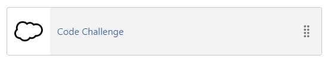
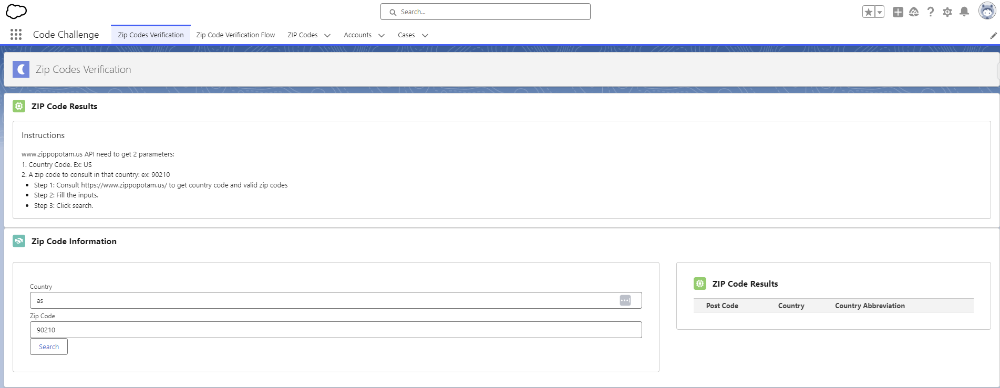
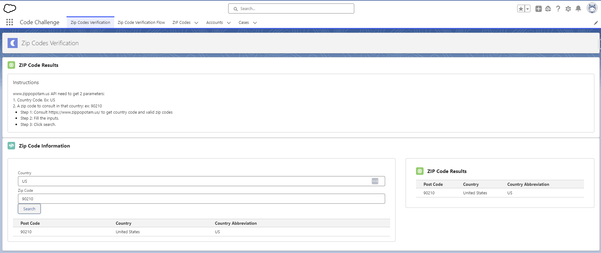
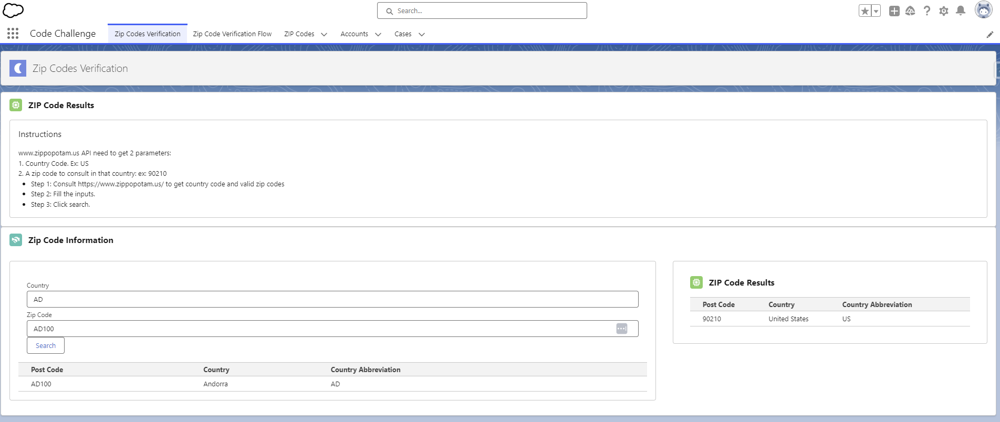
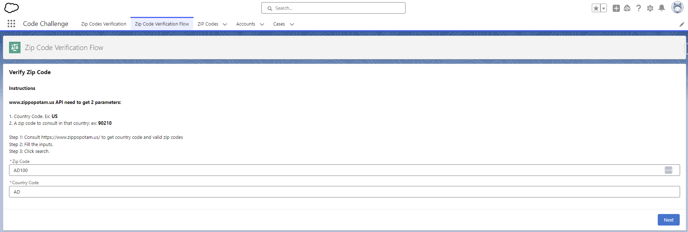
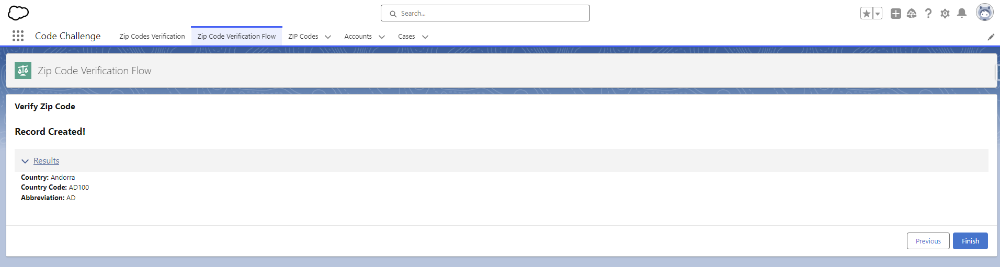
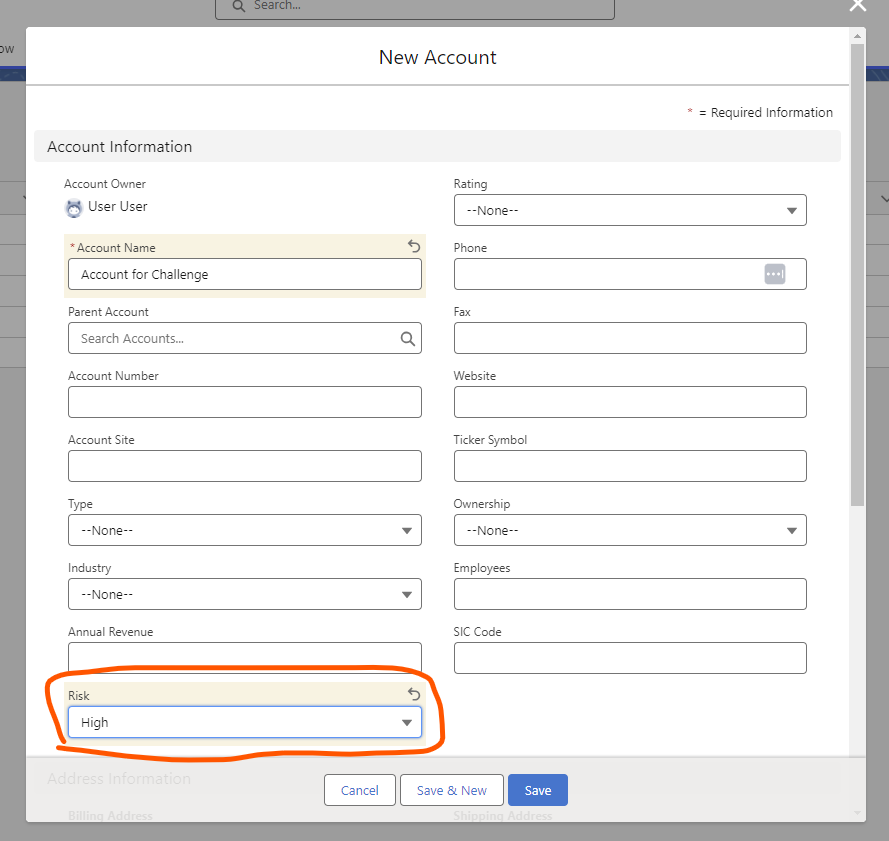
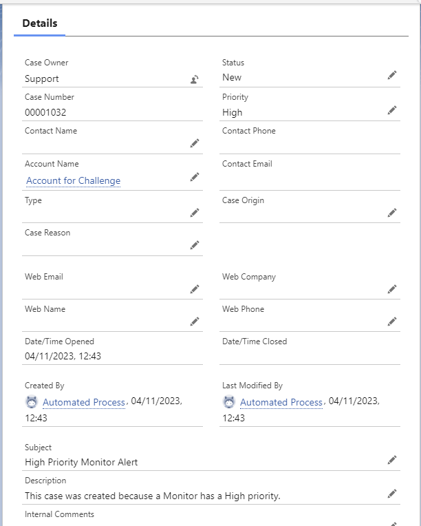

# Salesforce DX Project - Javier Flores - Code Challenge
## Additional Indications:
**This code can be installed in a scratch org, it contains:**
1. Custom App named "Code Challenge" with necessary tabs and other metadata needed (layouts, tabs, flow, LWC, Apex, etc).  

2. Assign "Named Credential" permission set to the user would be testing this app.

# Requirements:
## Use Case 1:
1)	Create a lwc (lightning web component) that takes zip code as an input and makes an api call. You can use the free zip code api (http://api.zippopotam.us/us/<zipcode>).
    - Assumptions: The API needs 2 parameters (country & zip code), I created the LWC & Flow to receive both.
2)	If the country in response is “US”, response should be shown in another lightning component (No need to save data) but if the country value is anything else, response should be stored in a custom object.
3)	We should be able to see the non-US data in a different screen.
    - Assumtion: I'll go with a object tab + list view to solve this requirement, as is an out of the box solution.
    - Assumtion: No need of additional LWC
4)	Achieve the same using flow with proper exception handling. For this create a separate UI experience. 

## Results 
### LWC

### Flow

## Use Case 2:
1)	Create a custom field called “Risk” with values as High, Low, Medium.
    - Assumtion: Account will have this new field.
2)	When the value “High” is selected, trigger a platform event.
3)	Platform event should be subscribed, and case should be created. Case Owner should be a user different than account owner. 
    - Assumtion: I created a queue named "Support" to assign the cases.
    - Assumtion: As this is a code challenge I created a trigger for subscription, but this can be solved with a flow as well.

## Results

Important Considerations
1)	All apex code should have proper error handling, should follow best practices.
2)	Code should be performant.

# Additional comments and recommendations
## Recommendations
1. UI interface improvements based on the SFDC design system.
2. Handle duplicates queries when consult the same zip code.

## Comments
1. Test apex classes not included.
2. JS test functions not included (JEST).
